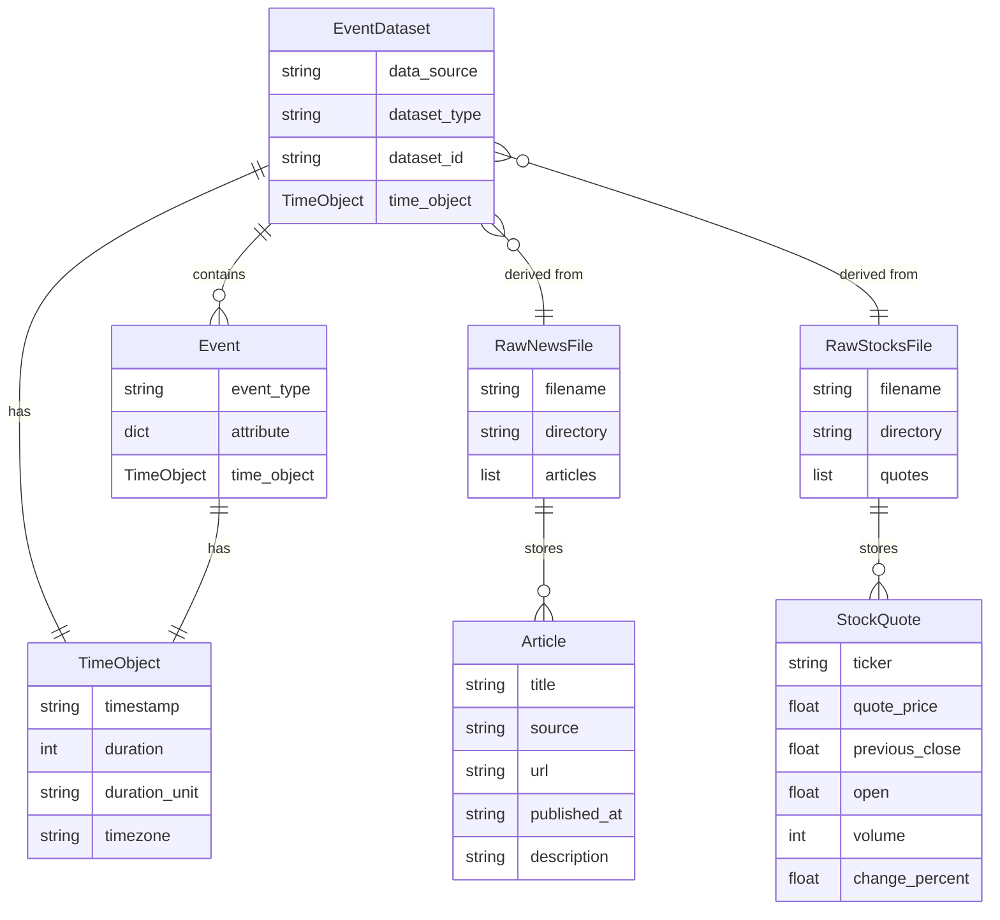
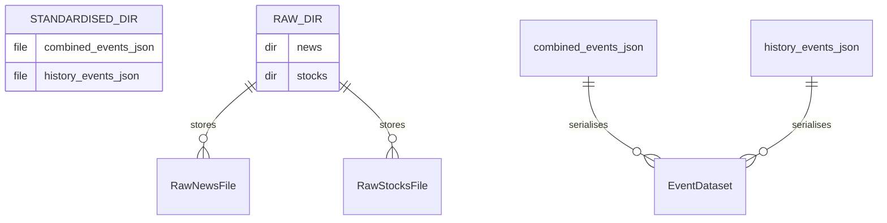
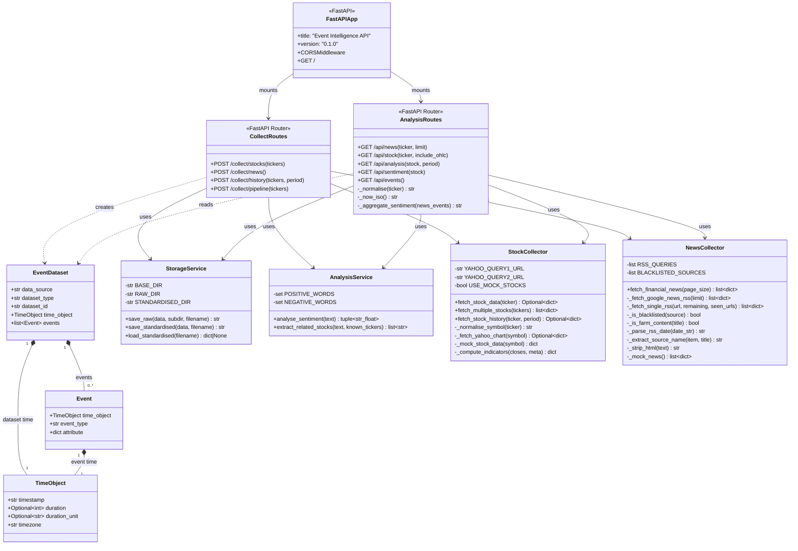
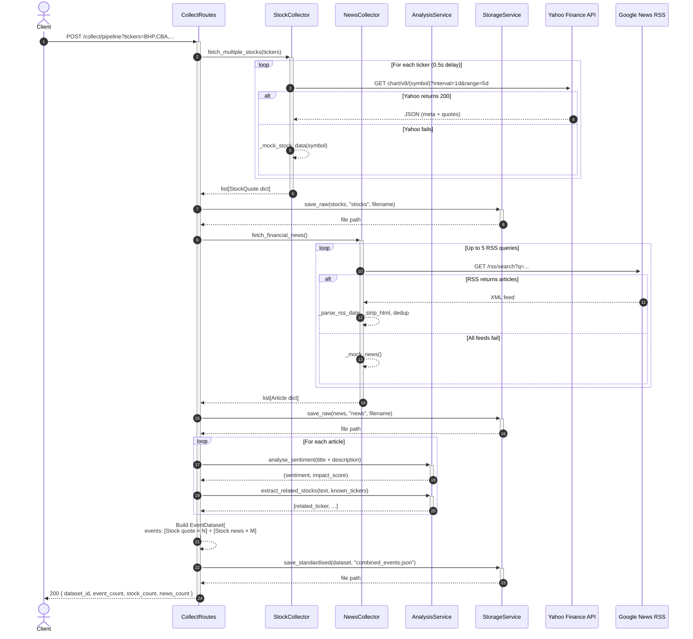
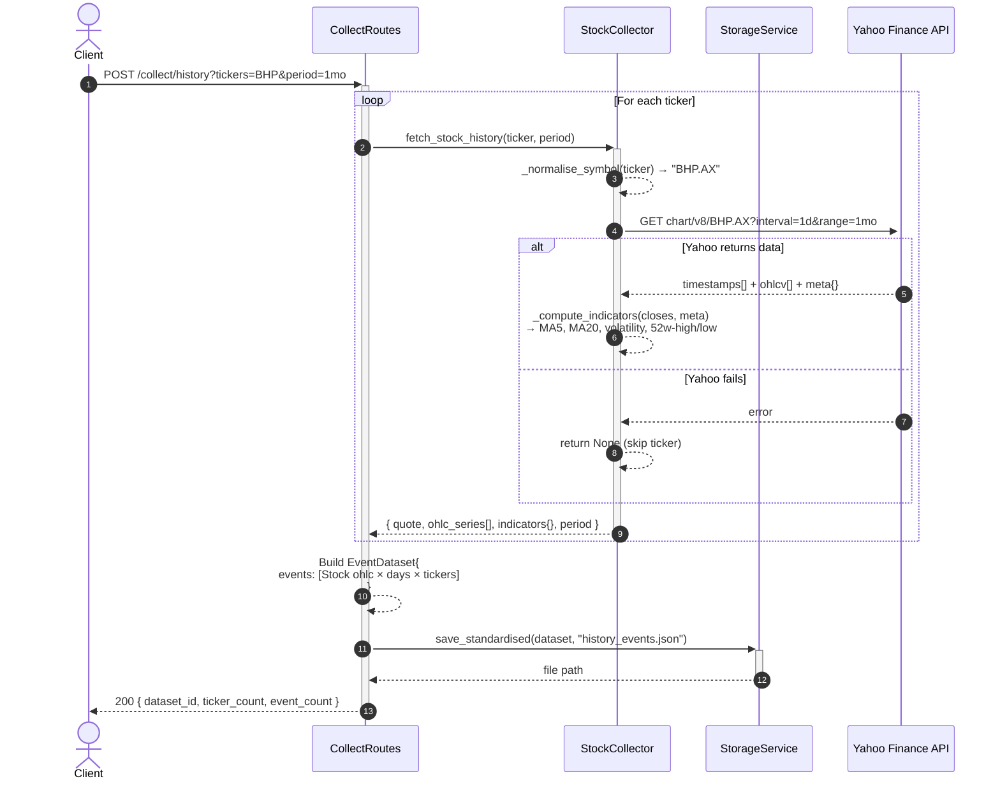
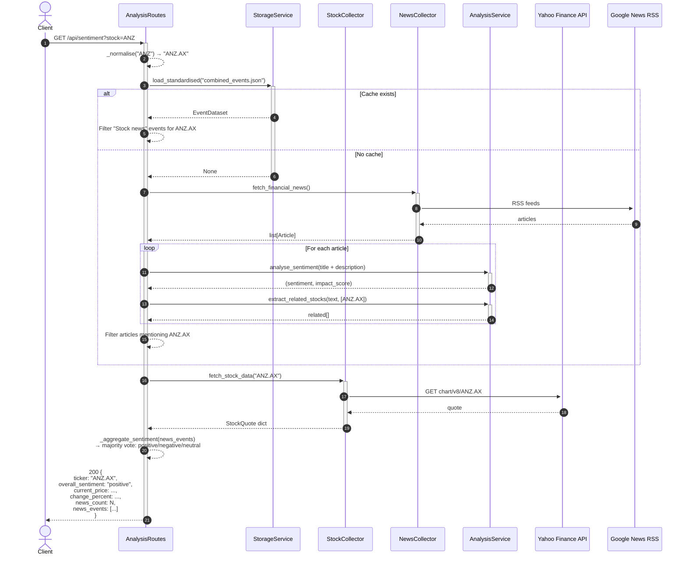
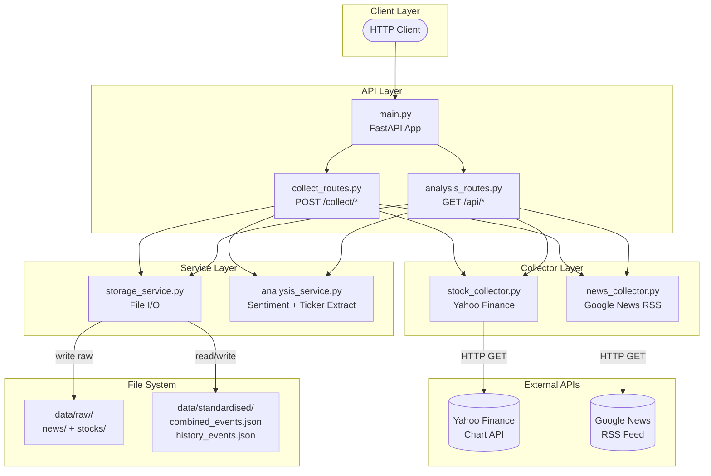

# Detailed Designs — Event Intelligence Service

> All diagrams use [Mermaid](https://mermaid.js.org/) syntax.
> Paste into any Confluence page that has the Mermaid macro, or preview at https://mermaid.live.

---

## 1. ER Diagram — Data Model & File Storage

The system uses **file-based JSON storage** (no relational database).
This diagram shows the logical entity relationships and the on-disk layout.



### Standardised File Layout



---

## 2. UML Class Diagram



---

## 3. Sequence Diagrams

### 3.1 POST `/collect/pipeline` — Full Data Collection Pipeline



---

### 3.2 POST `/collect/history` — OHLCV History Collection



---

### 3.3 GET `/api/news` — News Query with Cache-First Strategy

```mermaid
sequenceDiagram
    autonumber
    actor Client
    participant AR  as AnalysisRoutes
    participant SS  as StorageService
    participant NC  as NewsCollector
    participant AS  as AnalysisService
    participant GN  as Google News RSS
    participant FS  as File System

    Client ->>+ AR: GET /api/news?ticker=BHP&limit=20

    %% ── Cache check ──
    AR ->>+ SS: load_standardised("combined_events.json")
    SS ->>+ FS: read file
    alt File exists
        FS -->> SS: JSON content
        SS -->>- AR: EventDataset dict
        AR -->> AR: Filter events where<br/>event_type == "Stock news"<br/>AND ticker in attribute.related_stock
        AR -->>- Client: 200 { events: [...], total: N, source: "cache" }
    else File not found
        SS -->>- AR: None
        AR ->>+ NC: fetch_financial_news()
        NC ->>+ GN: RSS feeds
        GN -->> NC: articles
        NC -->>- AR: list[Article]
        loop For each article
            AR ->>+ AS: analyse_sentiment(text)
            AS -->>- AR: (sentiment, impact_score)
            AR ->>+ AS: extract_related_stocks(text, tickers)
            AS -->>- AR: [related, ...]
        end
        AR -->> AR: Build & filter ADAGE events
        AR -->>- Client: 200 { events: [...], total: N, source: "live" }
    end
```

---

### 3.4 GET `/api/stock` — Stock Quote (with optional OHLC)

```mermaid
sequenceDiagram
    autonumber
    actor Client
    participant AR  as AnalysisRoutes
    participant SS  as StorageService
    participant SC  as StockCollector
    participant YF  as Yahoo Finance API

    Client ->>+ AR: GET /api/stock?ticker=CBA&include_ohlc=true

    AR -->> AR: _normalise("CBA") → "CBA.AX"

    %% ── Cache check ──
    AR ->>+ SS: load_standardised("combined_events.json")
    alt Cache hit — ticker found
        SS -->> AR: EventDataset
        AR -->> AR: Extract "Stock quote" event for CBA.AX
        note over AR: include_ohlc=true → also load history cache
        AR ->>+ SS: load_standardised("history_events.json")
        alt History cache exists
            SS -->> AR: history EventDataset
        else No history cache
            SS -->> AR: None
            AR ->>+ SC: fetch_stock_history("CBA.AX", "1mo")
            SC ->>+ YF: GET chart/v8/CBA.AX (1mo, 1d)
            YF -->> SC: OHLCV data
            SC -->>- AR: { ohlc_series[], indicators{} }
        end
        AR -->>- Client: 200 EventDataset{ quote + ohlc }
    else Cache miss
        SS -->>- AR: None
        AR ->>+ SC: fetch_stock_data("CBA.AX")
        SC ->>+ YF: GET chart/v8/CBA.AX (5d, 1d)
        YF -->> SC: quote data
        SC -->>- AR: StockQuote dict
        opt include_ohlc = true
            AR ->>+ SC: fetch_stock_history("CBA.AX", "1mo")
            SC ->>+ YF: GET chart/v8/CBA.AX (1mo, 1d)
            YF -->> SC: OHLCV data
            SC -->>- AR: { ohlc_series[], indicators{} }
        end
        AR -->>- Client: 200 EventDataset{ quote [+ ohlc] }
    end
```

---

### 3.5 GET `/api/sentiment` — Sentiment Analysis for a Stock



---

### 3.6 Component Interaction Overview


