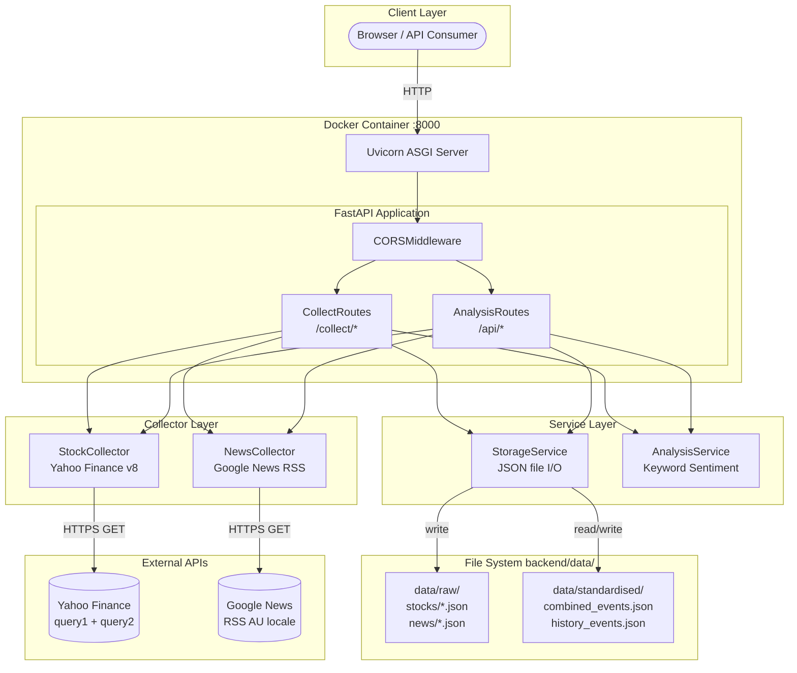
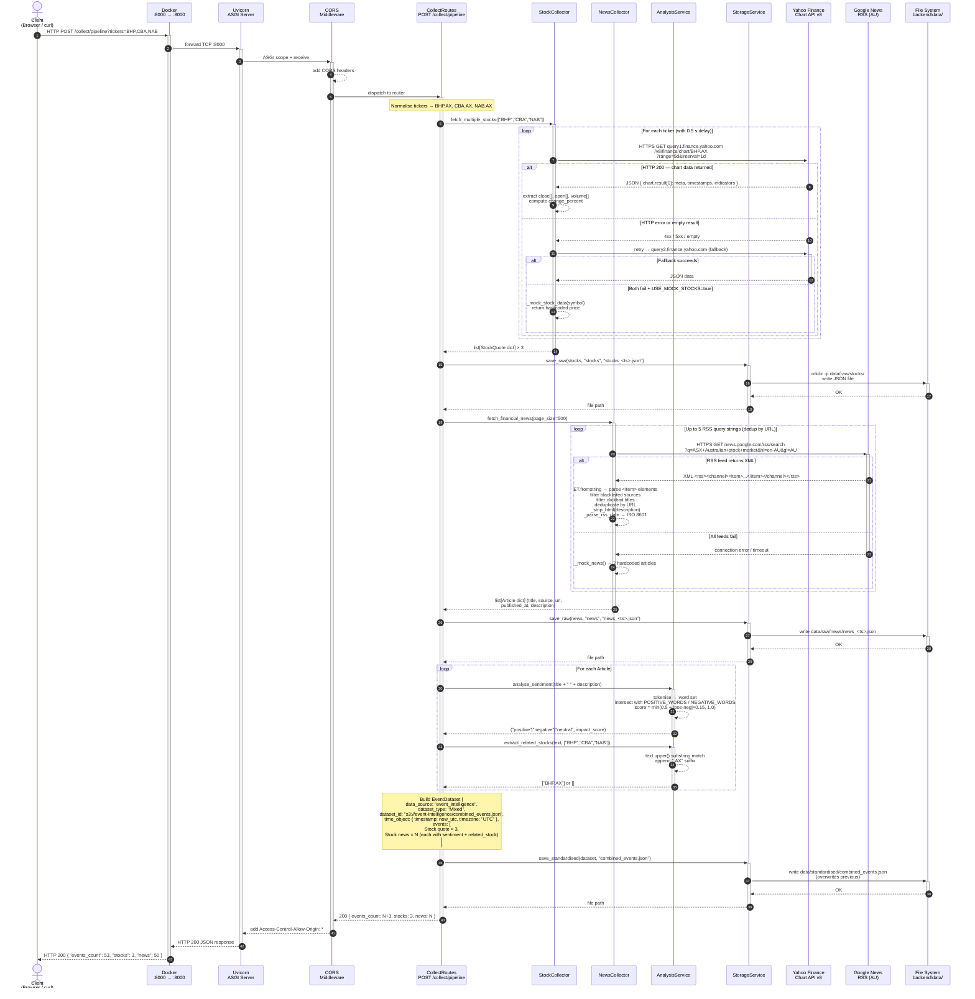

# Engineering Proposal — Event Intelligence Service

---

## Overview

The Event Intelligence Service is a RESTful API that collects, standardises, and analyses
Australian Securities Exchange (ASX) stock data and financial news.
It exposes stock quotes, OHLCV history, keyword-based sentiment analysis, and
ADAGE 3.0-formatted event datasets to downstream consumers.

---

## Technology Stack

| Layer | Technology | Role |
|---|---|---|
| **Container** | Docker (Python 3.11-slim) | Portable deployment, port mapping 8000:8000 |
| **ASGI Server** | Uvicorn 0.27 | Production-grade async HTTP server |
| **Web Framework** | FastAPI 0.109 | Route handling, validation, OpenAPI docs |
| **Data Validation** | Pydantic 2.5 | ADAGE 3.0 schema enforcement |
| **Stock Data** | Yahoo Finance Chart API v8 (unofficial) | Real-time quotes and OHLCV history |
| **News Data** | Google News RSS (AU locale) | Australian financial news feed |
| **Sentiment Engine** | Custom keyword lexicon (Python) | Positive/negative/neutral classification |
| **Storage** | Local JSON files (filesystem) | Raw and standardised ADAGE event datasets |
| **Testing** | Pytest + pytest-cov + HTTPX | Unit and integration tests |

---

## Architecture Diagram



---

## Sequence Diagram 1 — Full Data Collection Pipeline (`POST /collect/pipeline`)

This diagram shows the complete end-to-end flow when a client triggers the data ingestion pipeline.
It covers every layer of the stack: Docker networking, Uvicorn, FastAPI routing, collector HTTP calls
to external APIs, sentiment analysis, file system writes, and the final JSON response.



---

## Sequence Diagram 2 — End-to-End Sentiment Query (`GET /api/sentiment?stock=BHP`)

This diagram shows the complete request lifecycle for the primary read-path use case.
It demonstrates the cache-first strategy, the full stack traversal on a cache miss,
and how stock price data is combined with analysed news to produce a composite sentiment response.

```mermaid
sequenceDiagram
    autonumber
    actor Client as Client<br/>(Browser / curl)
    participant Docker as Docker<br/>:8000 → :8000
    participant UV as Uvicorn<br/>ASGI Server
    participant MW as CORS<br/>Middleware
    participant AR as AnalysisRoutes<br/>GET /api/sentiment
    participant SS as StorageService
    participant SC as StockCollector
    participant NC as NewsCollector
    participant AS as AnalysisService
    participant FS as File System<br/>backend/data/
    participant YF as Yahoo Finance<br/>Chart API v8
    participant GN as Google News<br/>RSS (AU)

    %% ── Incoming request ──────────────────────────────────────────
    Client  ->>+ Docker : HTTP GET /api/sentiment?stock=BHP
    Docker  ->>+ UV     : forward TCP :8000
    UV      ->>+ MW     : ASGI scope + receive
    MW      -->> MW     : validate Origin, add CORS headers
    MW      ->>+ AR     : dispatch to AnalysisRoutes

    AR      -->> AR     : _normalise("BHP") → "BHP.AX"

    %% ── Branch A: Cache hit ───────────────────────────────────────
    AR      ->>+ SS     : load_standardised("combined_events.json")
    SS      ->>+ FS     : stat + open data/standardised/combined_events.json

    alt FILE EXISTS (cache hit)
        FS  -->>- SS    : JSON bytes
        SS  -->> SS     : json.load() → EventDataset dict
        SS  -->>- AR    : EventDataset { data_source, events: [...] }

        AR  -->> AR     : filter events where<br/>event_type == "Stock quote"<br/>AND attribute.ticker == "BHP.AX"
        note right of AR: stock_data = events[0].attribute<br/>{ Quote Price, Previous Close,<br/>  Open, Volume, change_percent }

        AR  -->> AR     : filter events where<br/>event_type == "Stock news"<br/>AND attribute.related_stock == "BHP.AX"

        alt No ticker-specific news found
            AR -->> AR  : fallback → take up to 5 general news events<br/>(related_stock == null)
        end

        AR  -->> AR     : _aggregate_sentiment(news_events)<br/>count pos / neg / neutral<br/>return majority label (tie → "neutral")

        AR  -->>- MW    : 200 {<br/>  stock: "BHP.AX",<br/>  cached: true,<br/>  stock_data: { Quote Price: 45.20, ... },<br/>  overall_sentiment: "positive",<br/>  related_news: [ {title, sentiment, impact_score} × 10 ]<br/>}

    else FILE NOT FOUND (cache miss — live fetch)
        FS  -->>- SS    : FileNotFoundError
        SS  -->>- AR    : None

        %% ── Live stock quote ────────────────────────────────────
        AR  ->>+ SC     : fetch_stock_data("BHP.AX")
        SC  ->>+ YF     : HTTPS GET query1.finance.yahoo.com<br/>/v8/finance/chart/BHP.AX?range=5d&interval=1d
        alt Yahoo returns data
            YF  -->> SC : JSON chart result
            SC  -->> SC : extract regularMarketPrice,<br/>previousClose, open, volume,<br/>regularMarketChangePercent
            SC  -->>- AR: StockQuote dict { ticker, Quote Price, ... }
        else Yahoo fails
            YF  -->>- SC: error
            SC  -->> SC : USE_MOCK_STOCKS=true → _mock_stock_data("BHP.AX")
            SC  -->>- AR: mock StockQuote dict
        end

        %% ── Live news fetch + sentiment ─────────────────────────
        AR  ->>+ NC     : fetch_financial_news()
        NC  ->>+ GN     : HTTPS GET news.google.com/rss/search?q=ASX+...&gl=AU
        GN  -->>- NC    : XML feed
        NC  -->> NC     : parse → filter → deduplicate
        NC  -->>- AR    : list[Article] (up to 500)

        loop For each of first 10 articles
            AR  ->>+ AS : analyse_sentiment(title + description)
            AS  -->>- AR: (sentiment, impact_score)
            AR  ->>+ AS : extract_related_stocks(text, ["BHP"])
            AS  -->>- AR: ["BHP.AX"] or []
        end

        AR  -->> AR     : _aggregate_sentiment(news_events)

        AR  -->>- MW    : 200 {<br/>  stock: "BHP.AX",<br/>  cached: false,<br/>  stock_data: { Quote Price: 45.20, ... },<br/>  overall_sentiment: "negative",<br/>  related_news: [ {title, sentiment, impact_score} × 10 ]<br/>}
    end

    %% ── Response path ─────────────────────────────────────────────
    MW      -->>- UV    : HTTP 200 + Access-Control-Allow-Origin: *
    UV      -->>- Docker: serialise JSON response body
    Docker  -->>- Client: HTTP 200 JSON<br/>Content-Type: application/json
```

---

## Key Design Decisions

### Cache-First Read Strategy
All `GET /api/*` endpoints attempt to load from the pre-computed standardised JSON file
before making any external API calls. This minimises latency on repeat queries and
avoids hitting Yahoo Finance or Google News rate limits during normal read traffic.
The trade-off is that cached data may be stale until the next `POST /collect/pipeline` run.

### Dual-URL Yahoo Finance Fallback
`query1.finance.yahoo.com` and `query2.finance.yahoo.com` are tried in sequence.
If both fail (e.g. in CI or blocked networks), the `USE_MOCK_STOCKS` environment variable
enables deterministic mock prices for all 10 pre-defined ASX tickers.

### ADAGE 3.0 as the Canonical Output Format
All data — regardless of source — is transformed into the ADAGE `EventDataset` structure
before being persisted or returned. This ensures a single consistent schema for downstream
consumers and satisfies the project specification requirement.

### Stateless Service Design
The service itself holds no in-memory state between requests.
All persistence is delegated to the file system. This means the Docker container can be
restarted without data loss (provided the `data/` volume is mounted or the files survive),
and horizontal scaling is straightforward (though concurrent writes are not yet safe).
